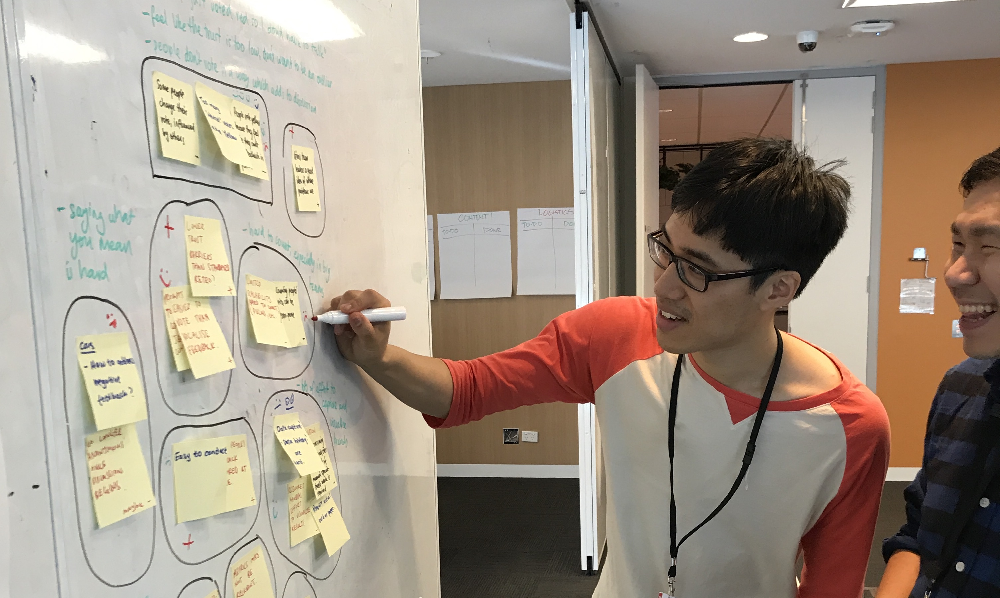
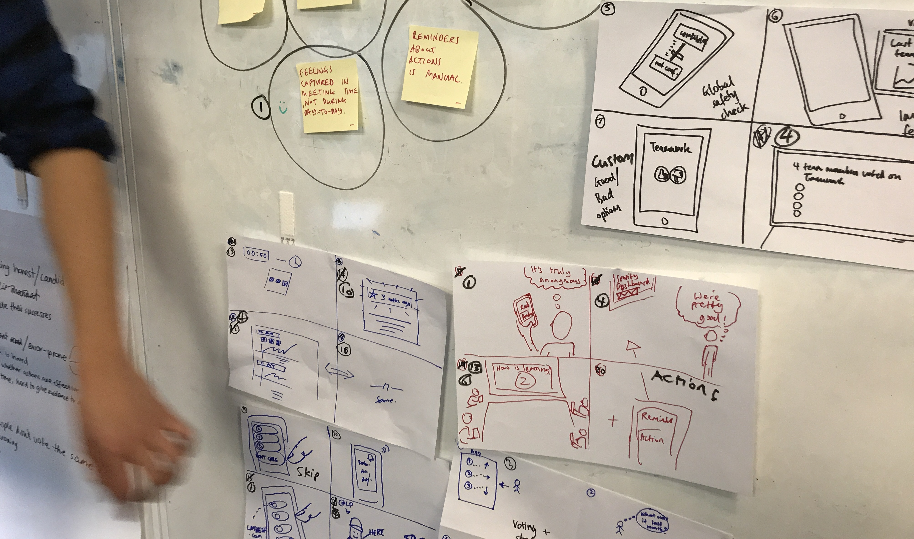
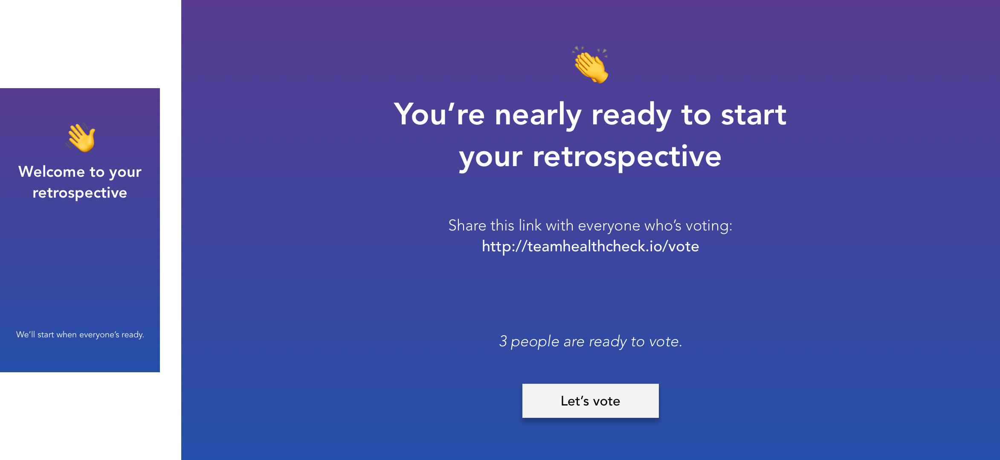
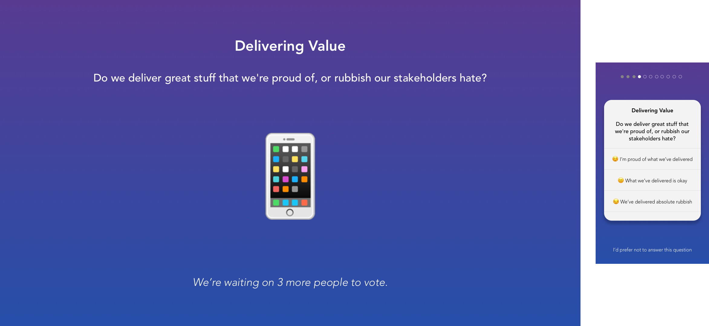
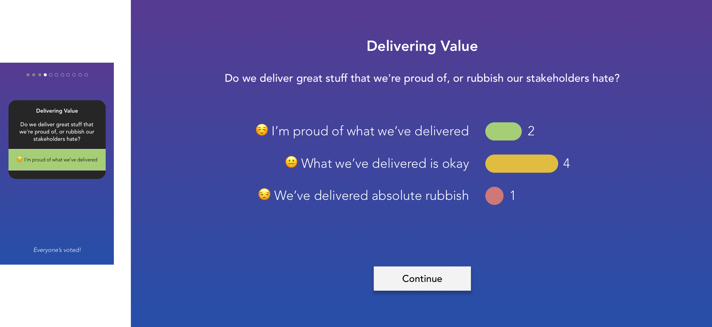
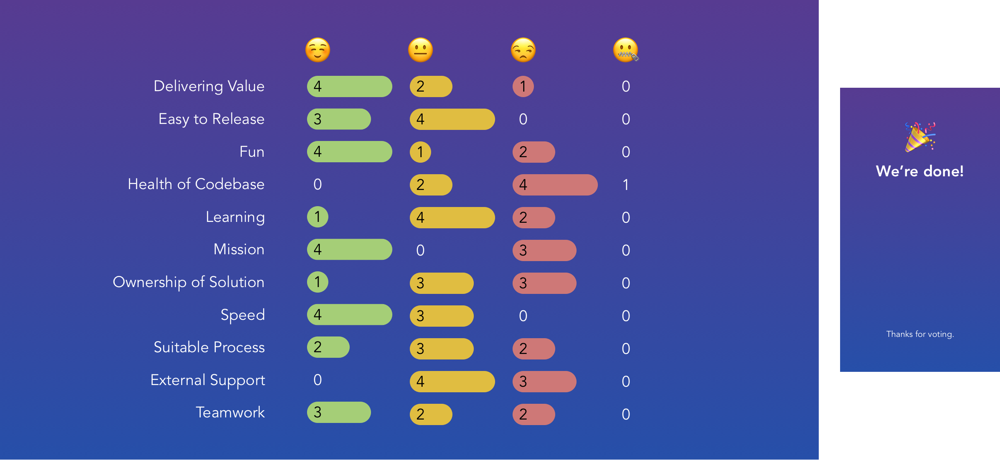
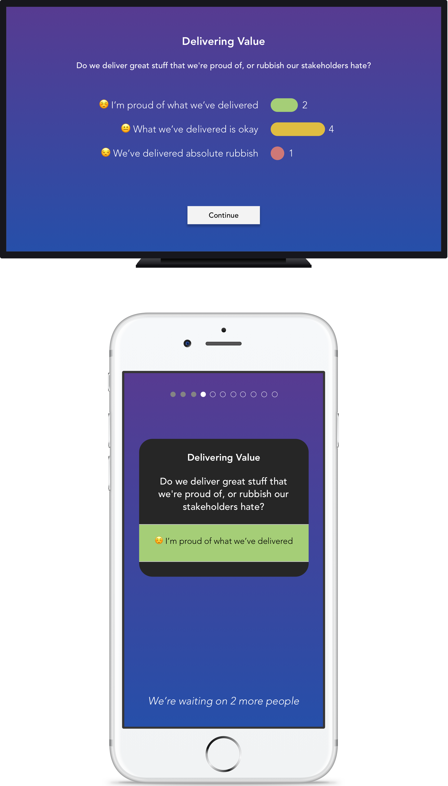

At a recent company-wide Hack Day, an idea was pitched to help improve the way we run retrospectives. Specifically, health-check retrospectives.

If you aren’t familiar, a retrospective is a team ritual for digital product teams which ideally happens every week or so. It involves talking through the week (or however long it’s been since the last retrospective) to identify what’s going well and what could do with improvement. The goal is to shorten the feedback cycle between how the team is working and the results they’re seeing.

About four years ago, just after I had started my new role at realestate.com.au, I facilitated [a new kind of retrospective which Spotify posted about](https://labs.spotify.com/2014/09/16/squad-health-check-model/) on their Labs blog. It was designed to help teams focus on core indicators of success, such as whether everyone believes they are contributing to the company’s mission in a worthwhile way, whether people are worried about the state of the code, and whether the team feels as if they are being provided opportunities to learn and grow.

Now widely used at the company, our teams feel it is an effective way to focus on the important factors of performance. However, the way we get our teams to vote on these factors in retrospectives can leave some feeling uncomfortable.

## Understanding the problem

The last time I facilitated a health-check retrospective with my team, it went like this:

1. I read out the first topic to vote on: “Delivering Value. Do we deliver great stuff that we’re proud of, or rubbish our stakeholders hate?”

2. Everyone thought for a moment and decided on one of three voting cards concealed in their hands: Green for _yay_, amber for _meh_, or red for _boo_. On my count, they all revealed their cards.

3. We spent time tallying the votes and writing them on the whiteboard. I had to count several times as our team is distributed, and it’s hard to see voting cards over the video conferencing connection.

4. We repeated steps 1 through 3 until we’d voted on all the topics we’d chosen beforehand.

5. The topics which looked interesting—spread out over the voting spectrum or really clumped together down the red end—were talked about at length. Usually I started by asking, “Is there anyone who voted [colour] who would like to start talking about this?”

My colleague, who worked as a business analyst in my team at the time, pulled me aside after the retrospective to confess something: He’d wanted to vote differently than he had done on several occasions, but quickly changed his vote when his stood out. He didn’t want to be an outlier, and so any concerns he had were put aside for the sake of agreeableness. I quickly admitted that I’d done the same too, many times before.

Clearly, this is a problem. Honesty and a willingness to talk about things that aren’t working are an important environment which must be cultivated for teams to flourish and perform well.

So, we decided we needed to make something.

## Defining a good outcome

When Hack Day came, my friend pitched his idea to fix retrospectives. We assembled a small team, and started discussing the problems we had each faced in our retrospectives as a group. We then voted on the important ones.

We wanted to focus on building something that would:

- Allow people to vote confidently and truthfully.
- Increase the scalability of health-checks to larger teams and teams with multiple distributed groups.
- Reduce the amount of time necessary to share retrospective results in a clear visual format.

The team then spent ten minutes quickly sketching four ideas each to satisfy the outcomes.

## Thinking visually

The curious thing about Hack Day is that it goes by so fast. It was decided that we weren’t going to have enough time to build a prototype before our time was up, so we settled on developing some visual designs to stir peoples’ imaginations.

I happily jumped at the chance to practice visual design, and attempted to explain the benefits of our idea in high-fidelity [Sketch](https://www.sketchapp.com/) mock-ups. By combining the best of our sketched ideas, we imagined a system involving two screens.

### Getting ready

When the team walks in to the retrospective, everyone can see a shared screen (such as a television or projection) which is connected to the facilitator’s computer.

Directed by the facilitation screen, everyone uses their phones to log in to the web app in preparation to vote.

### Voting

When the facilitator decides to begin, everyone collectively sees the topic being voted on, and a description which defines it.

Individually, people vote in private on their phones. Nobody knows the results until everyone has finished voting. This keeps anyone from feeling they have to vote to fit in.

### Tally

Once everyone has finished voting (or registered their abstention), the tally is automatically displayed on the facilitation screen.

This automatic tallying removes the repetitive counting facilitators often go through to make sure everyone’s opinion is accounted for, whether it be from across the table or across the ocean.

### Final results

Once all the topics have been voted upon, the final results are shown on the facilitator’s screen for everyone to see. The hope is that this visual format will be easily shareable.

## Testing a prototype

Our plan now is to use these mock-ups to make a prototype to test with teams. We plan to iterate on our findings and build a minimal viable product.

